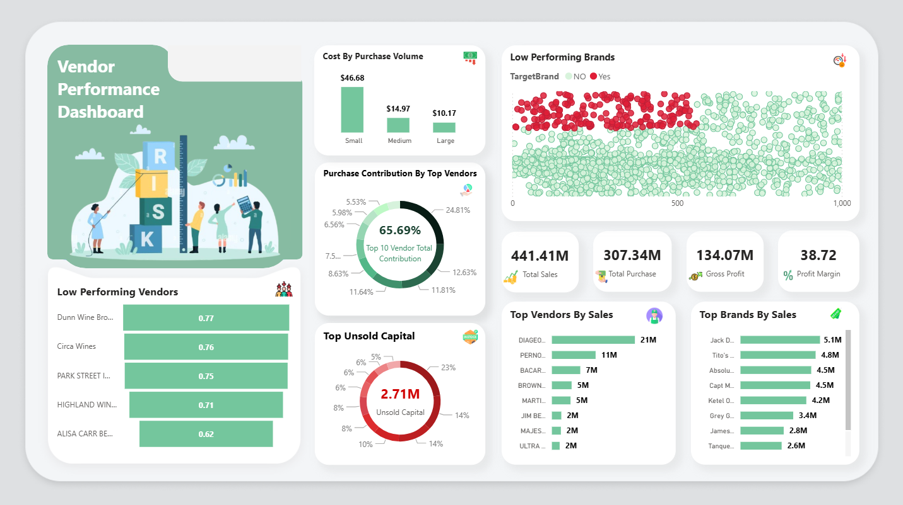

# Supplier Profitability & Dependency Risk Analysis (Vendor Performance)

**Industry:** Retail / Wholesale — Inventory & Procurement Optimization

---

## Executive summary

Companies frequently lose margin and cash when inventory, pricing and vendor relationships are not managed together. This project — *Supplier Profitability & Dependency Risk Analysis (Vendor Performance)* — analyzes purchases, sales, inventory and vendor invoices to identify where cash is tied up, which vendors drive revenue, and where pricing or inventory action will move the needle.

**What I delivered:** a vendor-level analytics pipeline (SQLite ➜ Python ➜ Power BI) that produces a single `vendor_sales_summary` used to:

* quantify vendor dependency,
* measure bulk-purchase advantages, and
* identify low-turnover inventory that ties up capital.

**Key quantified insights (high-level):**

* Bulk purchasing produced ~**72%** lower *unit purchase price* (Large vs Small order bins) — a clear lever for cost savings.
* Confidence intervals show **Top vendors’ mean profit margin ≈ 30.74%–31.61%**, while **Low vendors’ mean ≈ 40.48%–42.62%** (95% CI), and a two-sample t-test shows the difference is statistically significant.
* Several vendors concentrate procurement spend (Pareto): the top vendors supply a very high share of total purchases, indicating supplier concentration risk.

**Business impact:** using the recommendations in this repo a buyer or category manager can: free up working capital, negotiate better rates with high-volume suppliers, and grow sales for premium brands via targeted promotions.

---

## Business problem

Retail/wholesale businesses face three linked problems:

1. **Inefficient pricing & promotions:** some brands sell poorly despite healthy margins (missed volume opportunities).
2. **Vendor concentration risk:** a small set of vendors often accounts for most procurement spend (supply disruption risk).
3. **Inventory holding costs:** slow-moving SKUs tie up capital and reduce return on working capital.

This analysis answers: *Which vendors and brands should we promote, negotiate with, or reduce exposure to?* and *How much capital is locked in unsold inventory and which vendors are responsible?*.

---

## 🖼️ Dashboard Preview:

> ```markdown
> 
> ```


---

## Data & source tables

The analysis combines six tables (extracted from the company ERP/po/pos systems):

* `BEGIN_INVENTORY`, `END_INVENTORY` — opening & closing snapshots
* `PURCHASES` — PO-level transactions (quantity, dollars, vendor, purchase price)
* `PURCHASE_PRICE` — vendor price master / volume breaks
* `VENDOR_INVOICE` — invoice-level freight & approval info
* `SALES` — transactional sales data with excise taxes and selling price

I ingested these into a local SQLite DB and created a consolidated `vendor_sales_summary` (see `ingestion_db.py`) that powers all analysis and the Power BI dashboard.

---

## Methodology (brief)

* **Data engineering:** SQL CTEs to join purchase, sales, price and freight; read into Pandas, cleanup, and save a `vendor_sales_summary` CSV + write-back to SQLite.
* **Exploratory analysis:** distributions, boxplots, and outlier checks to understand price and margin spread.
* **Aggregation & segmentation:** vendor-level and brand-level aggregation, percentile binning (quartiles) for Top/Mid/Low segmentation.
* **Statistical testing:** two-sample t-test to compare profit margins between top- and low-performing vendors; 95% confidence intervals using `scipy.stats`/`numpy`.
* **Visualization:** Power BI dashboard with KPI cards, Pareto (combo chart), vendor risk heatmap, scatter plots for profit vs. sales, donut for vendor dependency, and boxplots for bulk pricing impact.

**Why this approach?** It balances reproducible ETL, defensible statistics, and executive-friendly visuals — making insights operational for procurement and business teams.

---

## Skills & tools used

* **Languages:** Python (pandas, numpy, scipy, matplotlib)
* **Database:** SQLite
* **BI / Viz:** Power BI (custom visuals for boxplot/histogram where needed)
* **Other:** GitHub (project repo & README), basic SQL (CTEs, GROUP BY), DAX (measures & helpful calculated tables)

---

## Results — Key findings (actionable & quantified)

1. **Bulk purchase advantage:** Large-order buyers pay significantly less per unit vs Small buyers — observed **~72%** reduction in unit purchase price between Small and Large order bins. Recommendation: implement tiered bulk discounts and enforce minimum economic order quantities for SKUs with stable demand.

2. **Top vendors dominate spend:** A Pareto analysis shows a small set of vendors accounts for the majority of purchase dollars (Top 10 vendors make up the lion’s share). This creates supplier concentration risk and negotiation opportunities.

3. **Profit vs volume trade-off:** High-volume vendors often have lower margins (competitive pricing), while low-volume vendors sometimes hold higher margins but low sales — candidates for promotional campaigns to grow volume.

4. **Inventory risk (unsold capital):** Several vendors contribute disproportionately to unsold inventory value. Reducing order quantities, launching clearance for slow SKUs, or returning to vendor (if contractual) will free capital.

5. **Statistical validation:** The difference in mean profit margins between top-performing and low-performing vendors is statistically significant (t-test: p < 0.001), with 95% CIs showing non-overlapping ranges — strong evidence to guide differentiated vendor strategies.

---

## Business recommendations (stakeholder-focused)

* **Procurement:** renegotiate terms with top-volume vendors for freight & unit price, and maintain strategic relationships with best-performing partners.
* **Category & Pricing:** run targeted promotions or bundle offers for premium brands with high margins but low volume — aim to increase sell-through without eroding margin.
* **Inventory:** implement min/max reorder policies and monitor SKU-level stock turnover; flag SKUs with StockTurnover < 1 for remediation.
* **Risk:** diversify supplier base for critical categories where Top 10 vendor dependency > X% (add contractual alternatives).
* **Reporting:** expose the Power BI dashboard to buyers and finance; include an automated weekly export of `UnsoldInventoryValue` by vendor into procurement reviews.

---

## How I Measured Key Metrics (Python & DAX)

This section highlights the core logic behind the most important calculations used throughout the project.

### 1️⃣ Purchase Contribution & Pareto (Python)

```python
# Total purchase contribution percentage
vendor_sales_summary['PurchaseContribution(%)'] = (
    vendor_sales_summary['TotalPurchaseDollars'] / vendor_sales_summary['TotalPurchaseDollars'].sum()
) * 100

# Cumulative contribution (Pareto)
vendor_sales_summary = vendor_sales_summary.sort_values('TotalPurchaseDollars', ascending=False)
vendor_sales_summary['CumulativeContribution(%)'] = vendor_sales_summary['PurchaseContribution(%)'].cumsum()
```

### 2️⃣ Profit Margin Calculation (Python)

```python
vendor_sales_summary['ProfitMargin'] = (
    vendor_sales_summary['GrossProfit'] / vendor_sales_summary['TotalSalesDollars']
) * 100
```

### 3️⃣ Stock Turnover Classification (DAX)

```DAX
StockTurnover Category = 
VAR ST = vendor_sales_summary[StockTurnover]
RETURN
    IF(ST < 1, "Low", IF(ST < 3, "Medium", "High"))
```

### 4️⃣ Top 10 Vendors (DAX)

```DAX
Vendor Rank = 
RANKX(
    ALL(vendor_sales_summary[VendorName]),
    CALCULATE(SUM(vendor_sales_summary[TotalPurchaseDollars])),
    , DESC
)

Is Top 10 Vendor = IF([Vendor Rank] <= 10, 1, 0)
```

---

## Limitations

* Analysis relies on historical transactional data; seasonality or one-off promotions can skew turnover and margin estimates.
* Purchase price master and freight allocation assumed matching by brand — imperfect mapping can introduce noise.
* Confidence intervals are computed at vendor-aggregated level; SKU-level variability may differ.

---

## What I learned

* Building a single source of truth (`vendor_sales_summary`) that blends purchases, sales, pricing and freight is critical to meaningful vendor-level analytics.
* Small modeling choices (sorting axis, cumulative measures) dramatically change visualization behavior; always validate measures against a trusted simple script (I compared every visual to a Python plot).
* Communicating results for procurement requires numbers and narratives: percent of spend, unsold capital, and actionable next steps.

---

## Next steps (recommended)

1. **Automate ingestion:** schedule the SQLite ingestion and a refresh for Power BI so buyers see near-real-time numbers.
2. **Pricing experiments:** run A/B promotions on 5–10 low-volume high-margin brands and measure lift and margin impact.
3. **Supplier scorecard:** add supplier-level KPIs (OTIF, returns, defect rate) to the dashboard for holistic vendor management.
4. **Advanced analytics:** build a demand-forecasting module (time-series) to reduce over-ordering and recommend optimal reorder points.

---

## Final findings

High-margin vendors may benefit from better pricing strategies, while top-selling vendors could focus on cost efficiency.

**Final Recommendations (summary):**

* Re-evaluate pricing for low-sales, high-margin brands to boost sales volume without sacrificing profitability.
* Diversify vendor partnerships to reduce dependency on a few suppliers and mitigate supply chain risks.
* Leverage bulk purchasing advantages to maintain competitive pricing while optimizing inventory management.
* Optimize slow-moving inventory by adjusting purchase quantities, launching clearance sales, or revising storage strategies.
* Enhance marketing and distribution strategies for low-performing vendors to drive higher sales volumes without compromising profit margins.

By implementing these recommendations, the company can achieve sustainable profitability, mitigate risks, and enhance overall operational efficiency.

---

## Contact

If you’d like to discuss the code, the dashboard, reach out on GitHub or email (kaifsdkpro@gmail.com).

---

*Made with ❤️ — Kaif Anis Sayed*
